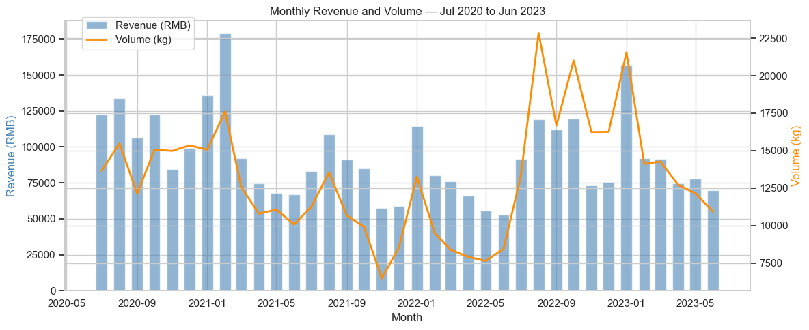
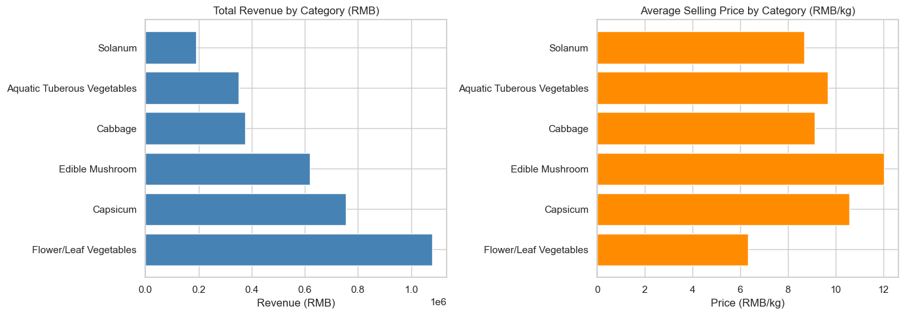
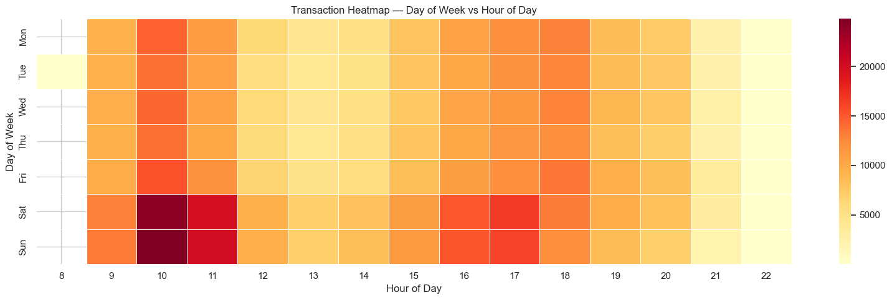
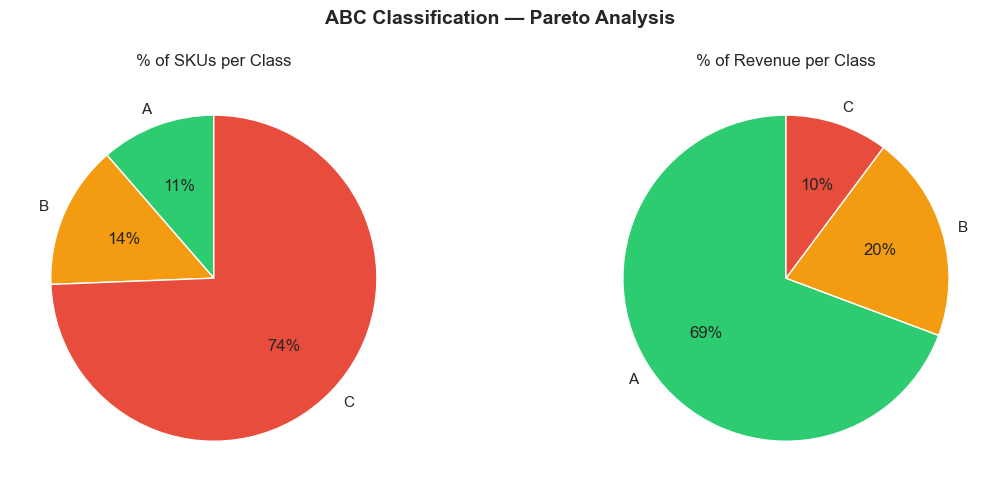
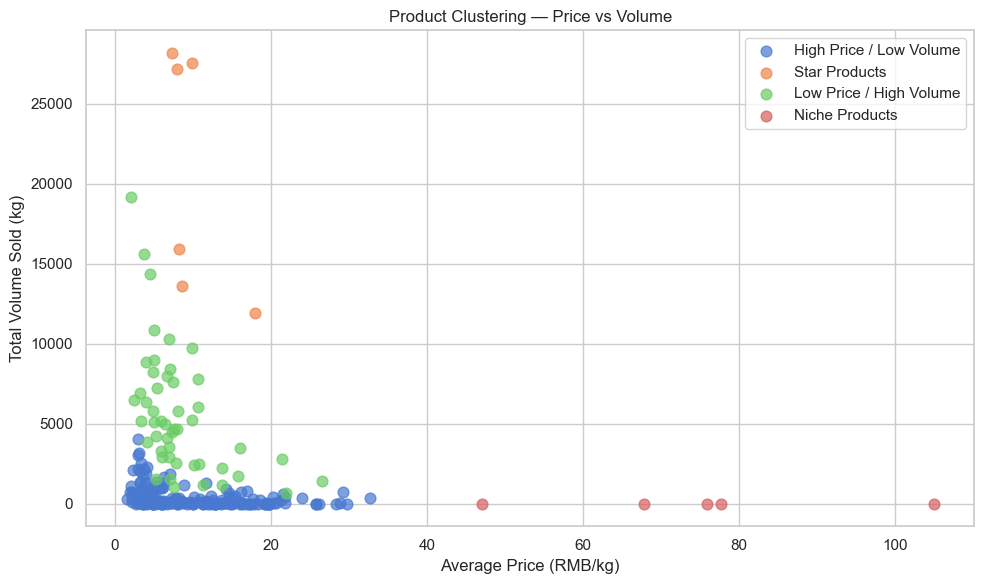

# Supermarket Sales Analytics — Snowflake SQL + Python

> End-to-end analytics project built on Snowflake, analyzing 3 years of fresh produce sales from a Chinese supermarket chain (Jul 2020 – Jun 2023).

[](https://www.snowflake.com/)
[](https://www.python.org/)
[](https://www.kaggle.com/datasets/yapwh1208/supermarket-sales-data)
[](LICENSE)

---

## Project Overview

This project demonstrates a full analytics lifecycle — from raw data ingestion and warehouse design in Snowflake to advanced SQL analytics and Python visualizations — using real supermarket transaction data.

### Dataset
- **Source**: [Kaggle — Supermarket Sales Data](https://www.kaggle.com/datasets/yapwh1208/supermarket-sales-data)
- **Period**: July 2020 – June 2023 (3 fiscal years)
- **Volume**: ~878K transactions across 251 fresh produce SKUs
- **Domain**: Fresh vegetable retail (6 categories)

| File | Description | Rows |
|------|-------------|------|
| `annex1.csv` | Product catalog (items + categories) | 251 |
| `annex2.csv` | Sales transactions | 878,503 |
| `annex3.csv` | Daily wholesale prices | 55,982 |
| `annex4.csv` | Product loss/shrinkage rates | 251 |

---

## Architecture

```
RAW LAYER
    annex1.csv → RAW_PRODUCTS
    annex2.csv → RAW_SALES
    annex3.csv → RAW_WHOLESALE_PRICES
    annex4.csv → RAW_LOSS_RATES
         ↓
ANALYTICS LAYER (Star Schema)
    DIM_PRODUCT
    DIM_DATE
    FACT_SALES
         ↓
REPORTING LAYER (Views)
    VW_MONTHLY_REVENUE
    VW_REVENUE_BY_CATEGORY
    VW_SALES_BY_WEEKDAY
    VW_MARGIN_BY_CATEGORY
    VW_ABC_CLASSIFICATION
         ↓
PYTHON LAYER (Notebook)
    Visualizations · Clustering
```

---

## 📁 Project Structure

```
supermarket_snowflake/
├── README.md
├── .gitignore
├── sql/
│   ├── 01_setup/
│   │   └── 01_create_database_and_warehouse.sql
│   ├── 02_staging/
│   │   ├── 01_create_stage_and_file_formats.sql
│   │   └── 02_create_and_load_raw_tables.sql
│   ├── 03_transform/
│   │   ├── 01_dim_product.sql
│   │   ├── 02_dim_date.sql
│   │   └── 03_fact_sales.sql
│   └── 04_analytics/
│       ├── 01_sales_kpis.sql
│       ├── 02_margin_analysis.sql
│       └── 03_abc_classification.sql
├── notebooks/
│   ├── supermarket_analysis.ipynb
│   └── images/
│       ├── monthly_revenue_trend.png
│       ├── revenue_bycategory.png
│       ├── sales_heatmap.png
│       ├── abc_chart.png
│       └── product_clustering.png
└── docs/
    ├── data_dictionary.md
    └── star_schema_diagram.md
```

---

## 🚀 How to Run

### Prerequisites
- Snowflake account (free trial works)
- Snowflake Web UI (Snowsight)
- Python 3.10+ with the following libraries:
  ```bash
  pip install snowflake-connector-python pandas matplotlib seaborn prophet scikit-learn python-dotenv
  ```
- The 4 CSV files from Kaggle

### Step-by-step execution

**1. Setup — create database, warehouse and schemas**
- Run `sql/01_setup/01_create_database_and_warehouse.sql`
- Use `COMPUTE_WH` as warehouse in the worksheet dropdown

**2. Staging — create file format, stage and load raw data**
- Run `sql/02_staging/01_create_stage_and_file_formats.sql`
- Upload the 4 CSV files to `SUPERMARKET_STAGE` via Snowsight UI
- Run `sql/02_staging/02_create_and_load_raw_tables.sql`

**3. Transform — build the star schema**
- Run `sql/03_transform/01_dim_product.sql`
- Run `sql/03_transform/02_dim_date.sql`
- Run `sql/03_transform/03_fact_sales.sql`

**4. Analytics — create reporting views**
- Run `sql/04_analytics/01_sales_kpis.sql`
- Run `sql/04_analytics/02_margin_analysis.sql`
- Run `sql/04_analytics/03_abc_classification.sql`

**5. Python notebook**
- Create a `.env` file in the root folder:
  ```
  SNOWFLAKE_ACCOUNT=your_account
  SNOWFLAKE_USER=your_user
  SNOWFLAKE_PASSWORD=your_password
  SNOWFLAKE_DATABASE=SUPERMARKET_DB
  SNOWFLAKE_WAREHOUSE=SUPERMARKET_WH
  ```
- Open and run `notebooks/supermarket_analysis.ipynb`

---

## 📊 Key Analyses & Results

### Monthly Revenue Trend


Revenue peaks every **January** due to the Chinese New Year effect, with the highest month reaching ~¥175K in January 2021. **September and November** show consistent dips every year. Volume in kg grew significantly in 2022–2023 while revenue stayed relatively flat, suggesting price compression in later years.

---

### Revenue by Category


**Flower/Leaf Vegetables** leads in total revenue driven by high volume, but has the lowest average price per kg (~¥6). **Edible Mushroom** commands the highest price (~¥12/kg), making it the margin leader despite lower volume.

---

### Transaction Heatmap — Day of Week vs Hour


**Saturday and Sunday between 10am–11am** are the busiest periods. There is a secondary peak around **5pm–6pm on weekdays**, likely customers buying after work. Activity is minimal before 8am and after 10pm.

---

### ABC Classification — Pareto Analysis


Only **28 products (11% of the catalog)** generate **69% of total revenue** (Class A). The bottom 183 products (74% of SKUs) contribute only 10% of revenue — a classic Pareto distribution with significant long-tail inventory.

---

### Product Clustering


K-Means clustering (k=4) reveals four distinct product profiles:
- **Star Products** (orange): medium price ¥5–20/kg, very high volume — the revenue backbone
- **Low Price / High Volume** (green): affordable staples with high turnover
- **High Price / Low Volume** (blue): specialty items with lower demand
- **Niche Products** (pink): premium pricing up to ¥105/kg but near-zero volume — candidates for SKU rationalization

---

## Key Findings

- **878,042 transactions** over 3 fiscal years (Jul 2020 – Jun 2023)
- **Flower/Leaf Vegetables** leads in revenue driven by volume; **Edible Mushroom** leads in price per kg
- **Saturdays and Sundays 10–11am** generate the most transactions
- **January** consistently peaks in revenue (Chinese New Year effect)
- **September and November** show negative growth every year (seasonal dip)
- Only **28 products (11% of catalog)** generate 69% of total revenue (Pareto principle)
- **Niche products** priced above ¥40/kg have near-zero volume — candidates for removal


---

## 📝Data Dictionary

See [`docs/data_dictionary.md`](docs/data_dictionary.md) for full column descriptions.

---

##  Credits

Dataset by [yapwh1208 on Kaggle](https://www.kaggle.com/datasets/yapwh1208/supermarket-sales-data).
